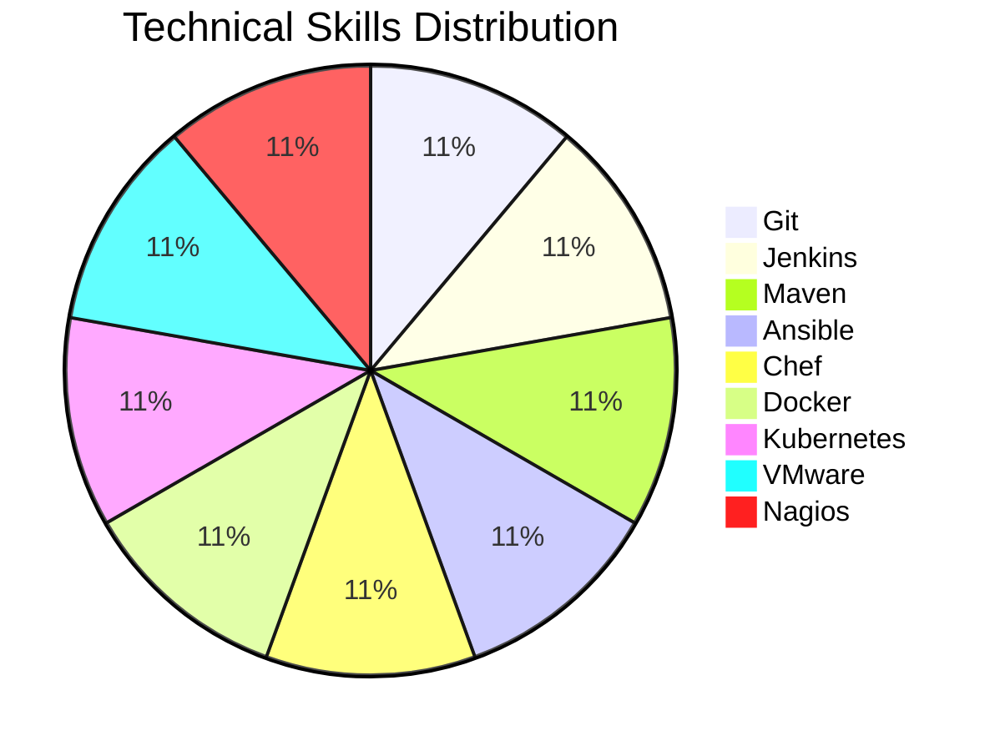

# 👋 Hi, I'm Pujara Aman

I am a passionate DevOps engineer with experience in cloud services, automation, and system management. I have hands-on expertise in various DevOps tools and AWS services, and I am constantly learning and expanding my skill set. Here’s a brief overview of my technical skills, projects, and achievements.

---

## 🛠️ **Technical Skills**

### DevOps Tools:
- **Version Control:**  Git
- **CI/CD Pipelines:**  Jenkins
- **Build Automation:**  Maven
- **Automation:**  Ansible
- **Configuration Management:**  Chef
- **Containerization:**  Docker
- **Container Orchestration:**  Kubernetes
- **Virtualization:**  VMware
- **Monitoring:**  Nagios

## ☁️ **Cloud Services**

### AWS Services

| Service        | Description                     |
|----------------|---------------------------------|
| EC2            | Virtual servers in the cloud     |
| S3             | Scalable storage for static files|
| VPC            | Virtual Private Cloud            |
| AMI            | Amazon Machine Image             |
| Auto Scaling   | Automatically scale resources    |
| ELB            | Elastic Load Balancer            |
| EBS            | Elastic Block Store              |
| RDS            | Relational Database Service      |
| Route 53       | Scalable DNS and domain name management |
| IAM            | Identity and Access Management   |
| Lambda         | Serverless compute service       |
| CloudFront     | Content delivery network (CDN)   |
| SNS            | Simple Notification Service      |
| CloudWatch     | Monitoring and observability service |

🐧 **Red Hat Linux**

- **Booting Process**: ███████████████████████████████████████████████ 90%
- **Data Management**: ██████████████████████████████████████████ 85%
- **User Management**: █████████████████████████████████████████ 80%
- **Group Management**: ████████████████████████████████████████ 75%
- **Permissions Management**: ██████████████████████████████████████ 70%
- **Umask**: █████████████████████████████████████ 65%
- **ACL**: ████████████████████████████████████ 60%
- **Disk Partition**: ████████████████████████████████ 55%
- **LVM**: ███████████████████████████████ 50%
- **Swap Partition**: █████████████████████████████ 45%
- **Archive Files Management**: ██████████████████████████ 40%
- **Network Management**: ███████████████████████ 35%
- **Service and Package Management**: █████████████████████ 30%
- **Task Scheduling**: ███████████████████ 25%
- **NFS Server**: ████████████████ 20%
- **Samba Server**: █████████████ 15%
- **Apache Server**: ███████████ 10%
- **FTP Server**: ███████ 5%
- **SELinux Policy**: ███████████████████████████████████████████ 50%

## 📈 **Skill Set Overview**

---

## 📚 **Projects**

### 1. **Automated Deployment of a Static Website on AWS**
- **Description:** Set up an automated CI/CD pipeline for deploying a static website using Jenkins, Docker, and AWS services.
- **Tools Used:** Git, Jenkins, Docker, AWS S3, CloudWatch
- **Key Achievements:** Streamlined the deployment process, improving efficiency and consistency.

### 2. **AWS Web Application Deployment**
- **Description:** Deployed and managed a scalable web application using AWS EC2, RDS, and S3.
- **Tools Used:** EC2, RDS, S3, CloudWatch
- **Key Achievements:** Ensured high availability and optimized resource usage for cost efficiency.

### 3. **Shell Script Automation for System Backup**
- **Description:** Automated the backup process of system files using shell scripting.
- **Tools Used:** Bash, Cron Jobs
- **Key Achievements:** Improved system backup efficiency and reduced manual intervention.

### 4. **Bluetooth Base Charge Control of Li-Po and Li-Ion Batteries**
- **Description:** Built a Bluetooth-controlled circuit for battery management via an Android app.
- **Tools Used:** MIT App Inventor, Bluetooth
- **Key Achievements:** Enabled parameter-based charging control through an Android device.

---

## 🏆 **Certifications**
- **AWS Solutions Architect - Associate**
- **Red Hat Certified System Administrator (RHCSA)**
- **Red Hat Certified Engineer (RHCE)**
- **Cisco Certified Network Associate (CCNA)**

---

## 📊 **GitHub Stats**

---

## 📫 **Connect with Me**
- **LinkedIn:** [Your LinkedIn Profile](https://www.linkedin.com/in/amanpujara)
- **Email:** [Your Email](pujaraamen2@example.com)

Feel free to check out my repositories and projects. Let's collaborate and build something awesome together!
