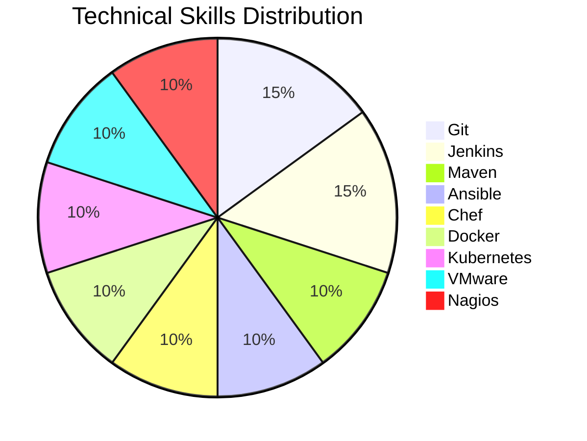

# 👋 Hi, I'm Pujara Aman

I am a passionate DevOps engineer with experience in cloud services, automation, and system management. I have hands-on expertise in various DevOps tools and AWS services, and I am constantly learning and expanding my skill set. Here’s a brief overview of my technical skills and projects.

---

## 🛠️ **Technical Skills**

### DevOps Tools:
- **Version Control:** Git
- **CI/CD Pipelines:** Jenkins
- **Build Automation:** Maven
- **Automation:** Ansible
- **Configuration Management:** Chef
- **Containerization:** Docker
- **Container Orchestration:** Kubernetes
- **Virtualization:** VMware
- **Monitoring:** Nagios

### Cloud Services:
- **AWS Services:** EC2, S3, RDS, CloudWatch, Route 53, Lambda

---

## 📈 **Skill Set Overview**



---

## 📚 **Projects**

### 1. **Automated Deployment of a Static Website on AWS**
- **Description:** Set up an automated CI/CD pipeline for deploying a static website using Jenkins, Docker, and AWS services.
- **Tools Used:** Git, Jenkins, Docker, AWS S3, CloudWatch
- **Key Achievements:** Streamlined the deployment process, improving efficiency and consistency.
  
### 2. **AWS Web Application Deployment**
- **Description:** Deployed and managed a scalable web application using AWS EC2, RDS, and S3.
- **Tools Used:** EC2, RDS, S3, CloudWatch
- **Key Achievements:** Ensured high availability and optimized resource usage for cost efficiency.

### 3. **Shell Script Automation for System Backup**
- **Description:** Automated the backup process of system files using shell scripting.
- **Tools Used:** Bash, Cron Jobs
- **Key Achievements:** Improved system backup efficiency and reduced manual intervention.

---

## 🏆 **Certifications**
- **AWS Solutions Architect - Associate**
- **Red Hat Certified System Administrator (RHCSA)**
- **Red Hat Certified Engineer (RHCE)**
- **Cisco Certified Network Associate (CCNA)**

---

## 📊 **GitHub Stats**


---

## 📫 **Connect with Me**
- **LinkedIn:** [Your LinkedIn Profile](https://linkedin.com/in/your-profile)
- **Email:** [Your Email](mailto:your-email@example.com)

Feel free to check out my repositories and projects. Let's collaborate and build something awesome together!
```
